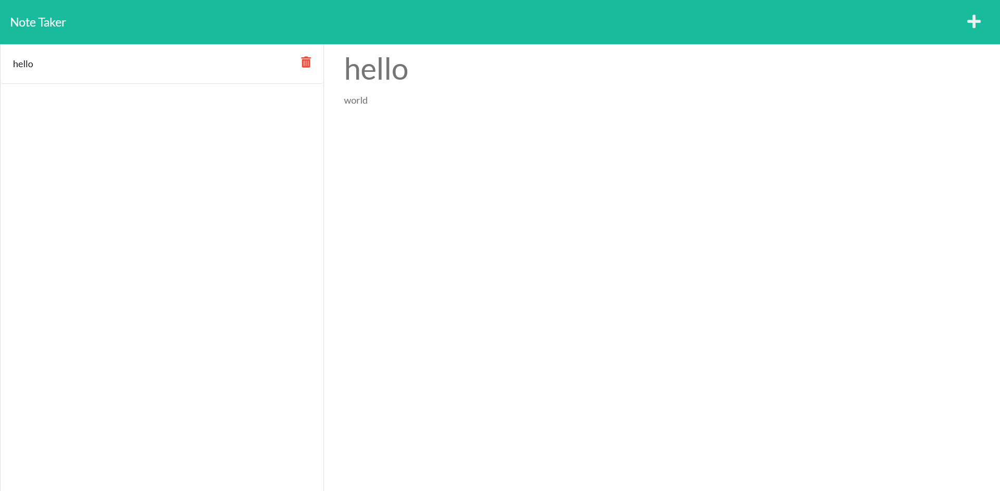

# Note Taker

## **Table of Contents**

- [Links](#links)
- [Description](#description)
- [Usage](#usage)
- [User Flow](#user-flow)
- [Technologies Used](#technologies-used)
- [Endpoints](#endpoints)
- [Screenshots](#screenshots)

# Links

Deployed Application: https://note-taker-harman.herokuapp.com/

## Description

A Note Taker application where the user can add notes, retrieve previous notes and delete notes.

## Usage

```
git clone git@github.com:AkenEagle/note-taker.git
npm i
npm run start
```

## User Flow

GIVEN a note-taking application

WHEN I open the Note Taker

THEN I am presented with a landing page with a link to a notes page

WHEN I click on the link to the notes page

THEN I am presented with a page with existing notes listed in the left-hand column, plus empty fields to enter a new note title and the note’s text in the right-hand column

WHEN I enter a new note title and the note’s text

THEN a Save icon appears in the navigation at the top of the page

WHEN I click on the Save icon

THEN the new note I have entered is saved and appears in the left-hand column with the other existing notes

WHEN I click on an existing note in the list in the left-hand column
THEN that note appears in the right-hand column

WHEN I click on the Write icon in the navigation at the top of the page

THEN I am presented with empty fields to enter a new note title and the note’s text in the right-hand column

## Technologies Used

Visual Studio Code

NodeJS

Express

Nodemon

UUID

Heroku

## Endpoints

### /api

- GET /notes
  This will return an array of notes

See sample response:

```json
[
  {
    "id": "4d2ca0f3-597d-488a-80c7-a8aad04c9b91",
    "title": "Test Title",
    "text": "Test text"
  },
  {
    "id": "26d33b16-7277-45f1-b8ec-8acdd5b6fec7",
    "title": "Test Title",
    "text": "Test text"
  }
]
```

- POST /notes
  This will create a new note

POST body:

```json
{
  "title": "your title",
  "text": "your text"
}
```

- DELETE /notes/:id
  This will delete a note by ID

## Screenshots


